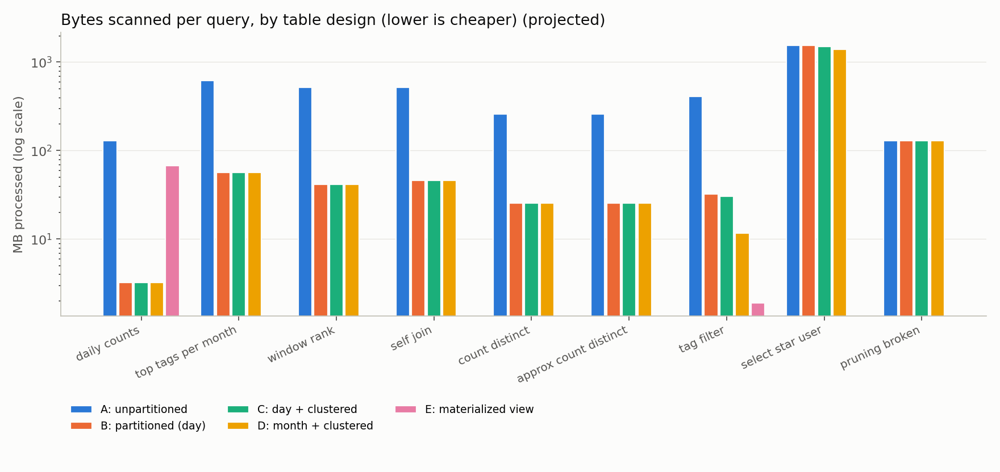

# bigquery-cost-lab

**How much does table design change what a BigQuery query costs?** I ran the same 9 analytical
queries against 4 physical layouts of the same ~17M-row Stack Overflow table, plus a
materialized view, and measured bytes scanned, slot time and dollar cost for every combination.

> **Headline:** _filled in from `results/results.md` after the run_



Full numbers: [`results/results.md`](results/results.md)

## Dataset

`bigquery-public-data.stackoverflow.posts_questions`, sliced to **2012-01-01 → 2021-12-31**
(3,653 days). I kept `id, creation_date, owner_user_id, tags, score, view_count, answer_count,
accepted_answer_id` and derived `primary_tag` (the first tag), and dropped `title` and `body`.

Why the slice: a single query job can write at most **4,000 partitions**, so a daily-partitioned
CTAS over the full 2008–2022 history (~5,100 days) fails. Dropping `body` keeps all four copies
well under the sandbox's 10 GB storage limit.

**Sandbox gotcha (dates shifted +16 years):** the free BigQuery sandbox forces
`partition_expiration_days = 60` on every partitioned table and ignores
`OPTIONS(partition_expiration_days = NULL)`. Every 2012–2021 partition was therefore deleted as soon
as it was written, and the first partitioned copies came out with **0 rows**, with no error. The
workaround is to shift every date forward 16 years (2012–2021 → 2028–2037). A multiple of 4 keeps
leap days and months aligned (weekdays move by one day). Every file under `sql/` is written
ready to paste into the sandbox, so queries use the shifted years (`2036` = 2020) and real table
names. With billing enabled, use `--shift-years 0` and `bench.py` moves the dates back.

## Variants

| Key | Table | Design |
|---|---|---|
| A | `so_raw` | plain copy: no partitioning, no clustering |
| B | `so_part_day` | `PARTITION BY DATE(creation_date)` |
| C | `so_part_day_clust` | B + `CLUSTER BY primary_tag, owner_user_id` |
| D | `so_part_month_clust` | `PARTITION BY TIMESTAMP_TRUNC(creation_date, MONTH)` + same clustering |
| E | `mv_daily_tag_counts` | materialized view: daily counts per `primary_tag`, over C |

## Queries

| # | What it does | Feature exercised |
|---|---|---|
| q01 | daily counts, Q1 2020 | partition pruning |
| q02 | top 5 tags per month, 2019 | `UNNEST(SPLIT())`, `QUALIFY` |
| q03 | each user's top-3 questions, 2021 | window function |
| q04 | 2018 askers who returned in 2021 | self-join |
| q05 | distinct askers, 2020 | `COUNT(DISTINCT)` |
| q06 | same, approximated | `APPROX_COUNT_DISTINCT` |
| q07 | monthly `python` questions, 2021 | first clustering column |
| q08 | `SELECT * … LIMIT 100` for one user, no date filter | anti-pattern + second clustering column |
| q09 | q01 with `FORMAT_TIMESTAMP(creation_date)` in the filter | broken partition pruning |

## How it's measured

* Every job runs with the query cache **off**. Each job is tagged with labels
  (`lab=bqcl, q=<query>, v=<variant>`), and the metrics come from
  `region-us.INFORMATION_SCHEMA.JOBS_BY_USER`
  (`total_bytes_processed`, `total_bytes_billed`, `total_slot_ms`, elapsed time).
* Cost = bytes billed × $6.25/TiB (on-demand, US). Billing has a 10 MB minimum per table referenced.
* The MV is created **after** the A–D runs. Once it exists, BigQuery's *smart tuning* can silently
  rewrite matching base-table queries to read it, which would skew C. That rewrite is measured
  separately as "C after MV".

## Run it yourself

**Option 1: Console only (no local setup).** In BigQuery Studio, go to *More → Query settings*
and untick "Use cached results". Then paste and run, in order:

1. `sql/run/01_build_tables.sql`. Check that the final SELECT shows the same row count for all 4 tables.
2. `sql/run/02_benchmark.sql` (36 labelled statements, run as one script)
3. `sql/run/03_build_mv.sql`
4. `sql/run/04_benchmark_mv.sql`
5. `sql/run/05_results.sql`, then *Save results → CSV* to `results/results.csv`

`sql/run/` is pre-generated for the sandbox (shift 16). With billing enabled, regenerate it first
with `python bench.py emit --shift-years 0`.

Then run `python bench.py report results/results.csv` to generate `results.md` and the chart.

**Option 2: Python**

```bash
pip install -r requirements.txt
gcloud auth application-default login
python bench.py emit --shift-years 16                   # 0 if billing is enabled
bq query --use_legacy_sql=false < sql/run/01_build_tables.sql
python bench.py run --project YOUR_PROJECT --phase base --shift-years 16 --dry-run   # preview bytes first
python bench.py run --project YOUR_PROJECT --phase base --shift-years 16  # 5 GB cap per query by default
bq query --use_legacy_sql=false < sql/run/03_build_mv.sql
python bench.py run --project YOUR_PROJECT --phase mv --shift-years 16
```

Everything in `sql/run/` is generated from `sql/templates/` and `sql/queries/` by
`python bench.py emit`. Edit those, not the generated files.

**Cost:** the whole lab processes a few GB, far below the 1 TB/month free tier. In the BigQuery
sandbox it is free by construction.

## Rules of thumb I learned

_Filled in from the measured results._

## Stretch ideas

* Add a variant clustered by `owner_user_id` first, to show that clustering-column order matters for q08.
* `CREATE SEARCH INDEX` on `tags` and compare it against `LIKE '%python%'`.
* BI Engine reservation (needs billing).
